:::::::::::::::::::::::::::::::::::::: questions 

- How do I access my data in R?
- How do I visualise my data with ggplot2?

::::::::::::::::::::::::::::::::::::::::::::::::

::::::::::::::::::::::::::::::::::::: objectives

- Read data into R
- To be able to use `ggplot2` to generate publication quality graphics.
- To understand the basic grammar of graphics, including the aesthetics and geometry layers, adding statistics, transforming scales, and colouring or panelling by groups.

::::::::::::::::::::::::::::::::::::::::::::::::

::::::::::::::::::::::::::::::::::::: keypoints

- Read data into R
- Use ggplot2 to create different types of plots

::::::::::::::::::::::::::::::::::::::::::::::::


## Motivation

Plotting the data is one of the best ways to quickly explore it and generate hypotheses about various relationships between variables.

There are several plotting systems in R, but today we will focus on `ggplot2` which implements **grammar of graphics** - a coherent system for describing components that constitute visual representation of data.
For more information regarding principles and thinking behind `ggplot2` graphic system, please refer to [Layered grammar of graphics](https://vita.had.co.nz/papers/layered-grammar.pdf) by Hadley Wickham (@hadleywickham). 

The advantage of `ggplot2` is that it allows R users to create publication quality graphics with a few lines of code. `ggplot2` has a large user base and is constantly developed and extended by the community.

## Getting data into R
We will start by reading the data into R, from the `data` folder you placed them in the last part of the introduction.


```r
penguins <- read.csv("data/penguins.csv")
```

This is our first bit of R code to "assign" data to an object in our "R environment".
The R environment can be seen in the upper right hand corner, and it lists everything R has access to at the moment.
You should see an object called "penguins", which is a Dataset with 344 observations and 8 variables.
We created this object with the line of code we just ran. 
You can "read" the line, right to left as:
"read the penguins.csv into R, and assign (<-) it to an object called penguins".
The arrow, or assignment, is R's way of creating new objects to work on.

**Note** a key difference from R and programs like SPSS or excel, is that when data is used in R, we do not automatically alter the data in the file we read it from. Everything we do with the penguins data in R from now on, only happens in R, and does not change the originating file. This way we cannot easily accidentally alter our raw data, which is a very good thing.

::::::::::::::::::::::::::::::::::::: keypoints
## Tip: We can inspect the data in several ways

1. Click the data name in the Environment, and the data opens as a tab in the scripts pane.  
2. Click the little arrow next to the data name in the Evironment, and you'll see a short preview of the data.  
3. Type `penguins` in the R console, and a preview will be shown of the data.  
::::::::::::::::::::::::::::::::::::: 

The dataset contains the following fields:

- **species**:           penguin species
- **island**:            island of observation
- **bill_length_mm**:    bill length in millimetres
- **bill_depth_mm**:     bill depth in millimetres
- **flipper_length_mm**: flipper length in millimetres
- **body_mass_g**:       body mass in grams
- **sex**:               penguin sex
- **year**:              year of observation


## Introduction to ggplot2

`ggplot2` is a core member of `tidyverse` family of packages. Installing and loading the package under the same name will load all of the packages we will need for this workshop. Lets get started!


```r
# install.packages("tidyverse")
library(tidyverse)
── Attaching packages ─────────────────────────────────────── tidyverse 1.3.2 ──
✔ ggplot2 3.3.6     ✔ purrr   0.3.4
✔ tibble  3.1.8     ✔ dplyr   1.0.9
✔ tidyr   1.2.0     ✔ stringr 1.4.0
✔ readr   2.1.2     ✔ forcats 0.5.1
── Conflicts ────────────────────────────────────────── tidyverse_conflicts() ──
✖ dplyr::filter() masks stats::filter()
✖ dplyr::lag()    masks stats::lag()
```

Here's a question that we would like to answer using `penguins` data: _Do penguins with deep beaks also have long beaks?_ This might seem like a silly question, but it gets us exploring our data.

To plot `penguins`, run the following code in the R-chunk or in console. The following code will put `bill_depth_mm` on the x-axis and `bill_length_mm` on the y-axis:


```r
ggplot(data = penguins) +
  geom_point(
    mapping = aes(x = bill_depth_mm,
                  y = bill_length_mm)
  )
Warning: Removed 2 rows containing missing values (geom_point).
```

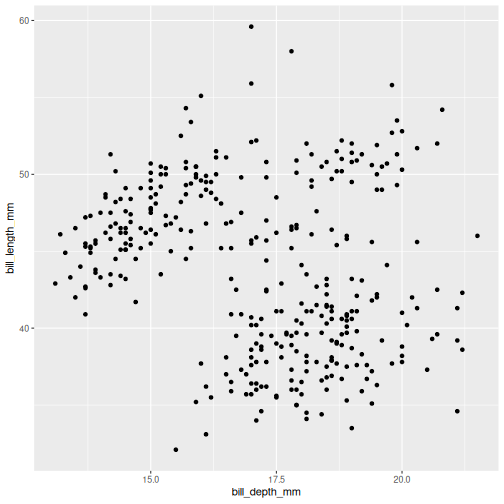

Note that we split the function into several lines.
In R, any function has a name and is followed by parentheses. Inside the parentheses we place any information the function needs to run.
Here, we are using two main functions, `ggplot()` and `geom_point()`.
To save screen space, we have placed each function on its own line, and also split up arguments into several lines.
How this is done depends on you, there are no real rules for this.
We will use the tidyverse coding style throughout this course, to be consistent and also save space on the screen.
The plus sign indicates that the ggplot is not over yet and that the next line should be interpreted as additional layer to the preceding `ggplot()` function. In other words, when writing a `ggplot()` function spanning several lines, the `+` sign goes at the end of the line, not in the beginning.

**Note** that in order to create a plot using `ggplot2` system, you should start your command with `ggplot()` function. It creates an empty coordinate system and initializes the dataset to be used in the graph (which is supplied as a first argument into the `ggplot()` function). In order to create graphical representation of the data, we can add one or more layers to our otherwise empty graph. Functions starting with the prefix `geom_` create a visual representation of data. In this case we added scattered points, using `geom_point()` function. There are many `geoms` in `ggplot2`, some of which we will learn in this lesson.

`geom_` functions create _mapping_ of variables from the earlier defined dataset to certain aesthetic elements of the graph, such as axis, shapes or colours. The first argument of any `geom_` function expects the user to specify these mappings, wrapped in the `aes()` (short for _aesthetics_) function. In this case, we mapped `bill_depth_mm` and `bill_length_mm` variables from `penguins` dataset to x and y-axis, respectively (using `x` and `y` arguments of `aes()` function). 

::::::::::::::::::::::::::::::::::::: challenge 
## Challenge 1a
How has bill length changed over time? What do you observe? 

:::::::::::::::::::::::::::::::::::::::: hint 

The* `penguins` *dataset has a column called `year`, which should appear on the x-axis.
:::::::::::::::::::::::::::::::::::::::: 

:::::::::::::::::::::::::::::::::::::::: solution 
## Solution 


```r
ggplot(data = penguins) +
  geom_point(
    mapping = aes(x = year, 
                  y = bill_length_mm)
  )
Warning: Removed 2 rows containing missing values (geom_point).
```

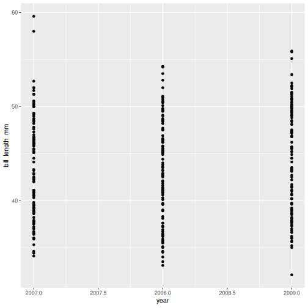
:::::::::::::::::::::::::::::::::::::::: 
::::::::::::::::::::::::::::::::::::: 

::::::::::::::::::::::::::::::::::::: challenge 
## Challenge 1b
Try a different `geom_` function called `geom_jitter`. How is that different from `geom_point`?

:::::::::::::::::::::::::::::::::::::::: solution 
## Solution


```r
ggplot(data = penguins) +
  geom_jitter(
    mapping = aes(x = year, 
                  y = bill_length_mm)
  )
Warning: Removed 2 rows containing missing values (geom_point).
```

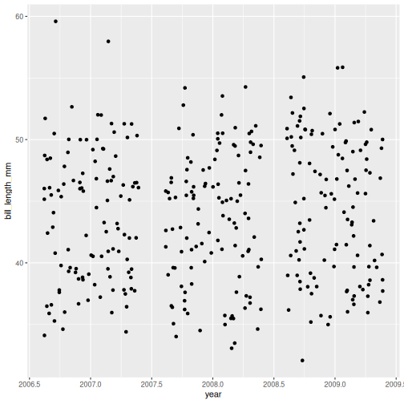
:::::::::::::::::::::::::::::::::::::::: 
::::::::::::::::::::::::::::::::::::: 


## Mapping data

What if we want to combine graphs from the previous two challenges and show the relationship between three variables in the same graph? Turns out, we don't necessarily need to use third geometrical dimension, we can employ colour.

The following graph maps `island` variable from `penguins` dataset to the `colour` aesthetic of the plot. Let's take a look:


```r
ggplot(data = penguins) + 
  geom_jitter(
    mapping = aes(x = bill_depth_mm, 
                  y = bill_length_mm, 
                  colour = island)
  )
Warning: Removed 2 rows containing missing values (geom_point).
```

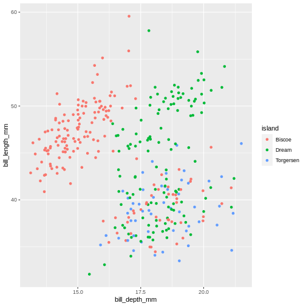

::::::::::::::::::::::::::::::::::::: challenge 
## Challenge 2
What will happen if you switch colour to also be by year? Is the graph still useful? Why or why not? What is the difference in the plot between when you colour by island and when you colour by year?

:::::::::::::::::::::::::::::::::::::::: solution 
## Solution


```r
ggplot(data = penguins) +
  geom_jitter(
    mapping = aes(x = bill_depth_mm, 
                  y = bill_length_mm,
                  colour = year)
  )
Warning: Removed 2 rows containing missing values (geom_point).
```

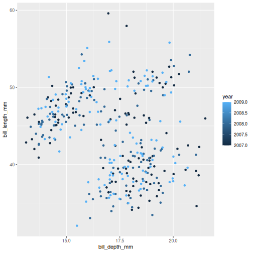

Island is a categorical variable, in R we call it a factor. The colours get tagged with their factor in the legend, so we can interpret which colour belongs to which factor. `year` is a numerical variable, so the colour becomes a gradient colour bar, rather than showing fewer distinctly different colours. ggplot treats numerical and factors different in this way precisely.
:::::::::::::::::::::::::::::::::::::::: 
::::::::::::::::::::::::::::::::::::: 


There are other aesthetics that can come handy. One of them is `size`. The idea is that we can vary the size of data points to illustrate another continuous variable, such as species bill depth. Lets look at four dimensions at once! 


```r
ggplot(data = penguins) + 
  geom_jitter(
    mapping = aes(x = bill_depth_mm, 
                  y = bill_length_mm, 
                  colour = species, 
                  size = year)
  )
Warning: Removed 2 rows containing missing values (geom_point).
```

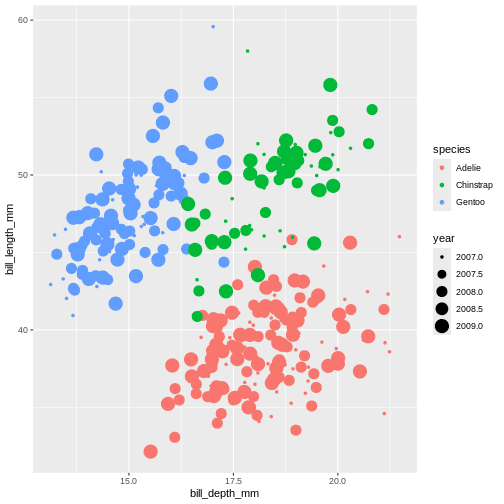

It might be even better to try another type of aesthetic, like shape, for categorical data like species.


```r
ggplot(data = penguins) + 
  geom_jitter(
    mapping = aes(x = bill_depth_mm, 
                  y = bill_length_mm, 
                  colour = species, 
                  shape = species)
  )
Warning: Removed 2 rows containing missing values (geom_point).
```

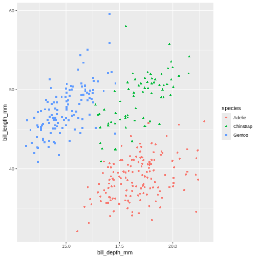

Playing around with different aesthetic mappings until you find something that really makes the data "pop" is a good idea. A plot is rarely made nice on the first try, we all try different configurations until we find the one we like.

# Setting values

Until now, we explored different aesthetic properties of a graph mapped to certain variables. What if you want to recolour or use a certain shape to plot all data points? Well, that means that such colour or shape will no longer be *mapped* to any data, so you need to supply it to `geom_` function as a separate argument (outside of the `mapping`). 
This is called "setting" in the ggplot2-world. We "map" aesthetics to data columns, or we "set" single values outside aesthetics to apply to the entire geom or plot.
Here's our initial graph with all colours coloured in blue.


```r
ggplot(data = penguins) + 
  geom_point(
    mapping = aes(x = bill_depth_mm, 
                  y = bill_length_mm),
    colour = "blue"
  )
Warning: Removed 2 rows containing missing values (geom_point).
```

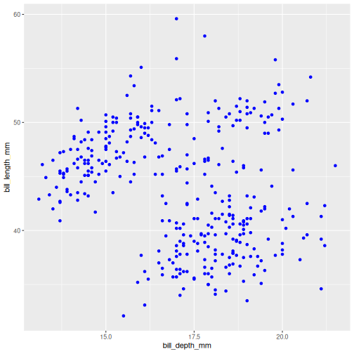

Once more, observe that the colour is now not mapped to any particular variable from the `penguins` dataset and applies equally to all data points, therefore it is outside the `mapping` argument and is not wrapped into `aes()` function. Note that set colours are supplied as characters (in quotes). 

::::::::::::::::::::::::::::::::::::: challenge 
## Challenge 3
Change the transparency (alpha) of the data points by year. 

:::::::::::::::::::::::::::::::::::::::: hint 
`alpha` takes a value from 0 (transparent) to 1 (solid).
:::::::::::::::::::::::::::::::::::::::: 

:::::::::::::::::::::::::::::::::::::::: solution 
## Solution


```r
ggplot(data = penguins) + 
  geom_point(
    mapping = aes(x = bill_depth_mm, 
                  y = bill_length_mm, 
                  alpha = year)
  )
Warning: Removed 2 rows containing missing values (geom_point).
```

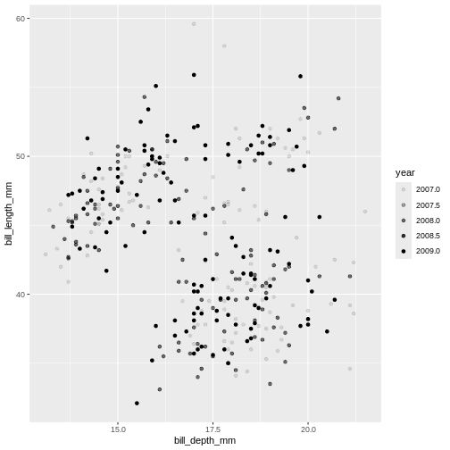

:::::::::::::::::::::::::::::::::::::::: 
::::::::::::::::::::::::::::::::::::: 

::::::::::::::::::::::::::::::::::::: challenge 
## Challenge 4
Move the transparency outside the `aes()` and set it to `0.5`. What can we benefit of each one of these methods?

:::::::::::::::::::::::::::::::::::::::: solution 
## Solution


```r
ggplot(data = penguins) + 
  geom_point(
    mapping = aes(x = bill_depth_mm, 
                  y = bill_length_mm),
    alpha = 0.5)
Warning: Removed 2 rows containing missing values (geom_point).
```

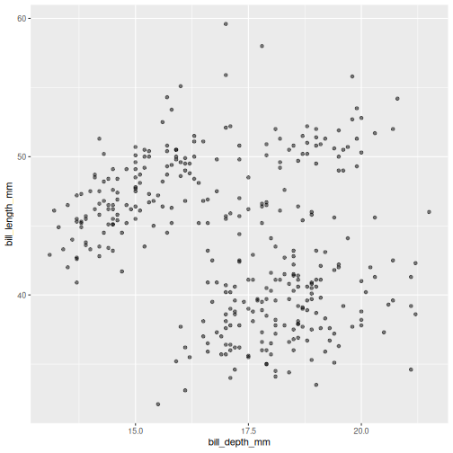
Controlling the transparency can be a great way to "mute" the visual effect of certain data, while still keeping it visible. Its a great tool when you have many data points or if you have several geoms together, like we will see soon.
:::::::::::::::::::::::::::::::::::::::: 
::::::::::::::::::::::::::::::::::::: 
 


# Geometrical objects

Next, we will consider different options for `geoms`. Using different `geom_` functions user can highlight different aspects of data. 

A useful geom function is `geom_boxplot()`. It adds a layer with the "box and whiskers" plot illustrating the distribution of values within categories. The following chart breaks down bill length by island, where the box represents first and third quartile (the 25th and 75th percentiles), the middle bar signifies the median value and the whiskers extent to cover 95% confidence interval. Outliers (outside of the 95% confidence interval range) are shown separately.


```r
ggplot(data = penguins) + 
  geom_boxplot(
    mapping = aes(x = species, 
                  y = bill_length_mm)
  )
Warning: Removed 2 rows containing non-finite values (stat_boxplot).
```

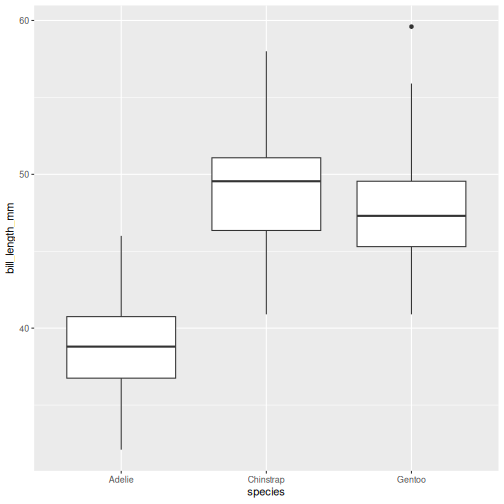

Layers can be added on top of each other. In the following graph we will place the boxplots **over** jittered points to see the distribution of outliers more clearly. We can map two aesthetic properties to the same variable. Here we will also use different colour for each island.


```r
ggplot(data = penguins) + 
  geom_jitter(
    mapping = aes(x = species, 
                  y = bill_length_mm, 
                  colour = species)
  ) +
  geom_boxplot(
    mapping = aes(x = species,
                  y = bill_length_mm)
  )
Warning: Removed 2 rows containing non-finite values (stat_boxplot).
Warning: Removed 2 rows containing missing values (geom_point).
```

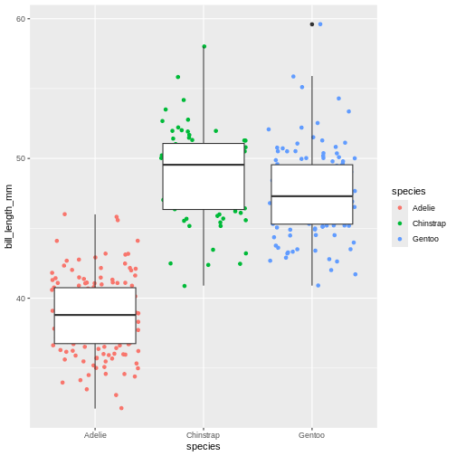

Now, this was slightly inefficient due to duplication of code - we had to specify the same mappings for two layers. To avoid it, you can move common arguments of `geom_` functions to the main `ggplot()` function. In this case every layer will "inherit" the same arguments, specified in the "parent" function.


```r
ggplot(data = penguins,
       mapping = aes(x = island, 
                     y = bill_length_mm)
) + 
  geom_jitter(aes(colour = island)) +
  geom_boxplot(alpha = .6)
Warning: Removed 2 rows containing non-finite values (stat_boxplot).
Warning: Removed 2 rows containing missing values (geom_point).
```


You can still add layer-specific mappings or other arguments by specifying them within individual geoms. Here, we've set the transparency of the boxplot to .6, so we can see the points behind it, and also mapped colour to island in the points. We would recommend building each layer separately and then moving common arguments up to the "parent" function.

We can use linear models to highlight differences in dependency between bill length and body mass by island. Notice that we added a separate argument to the `geom_smooth()` function to specify the type of model we want `ggplot2` to built using the data (linear model). The `geom_smooth()` function has also helpfully provided confidence intervals, indicating "goodness of fit" for each model (shaded gray area). For more information on statistical models, please refer to help (by typing `?geom_smooth`)


```r
ggplot(data = penguins, 
       mapping = aes(x = bill_depth_mm, 
                     y = bill_length_mm)
) +
  geom_point(alpha = 0.5) +
  geom_smooth(method = "lm")
`geom_smooth()` using formula 'y ~ x'
Warning: Removed 2 rows containing non-finite values (stat_smooth).
Warning: Removed 2 rows containing missing values (geom_point).
```

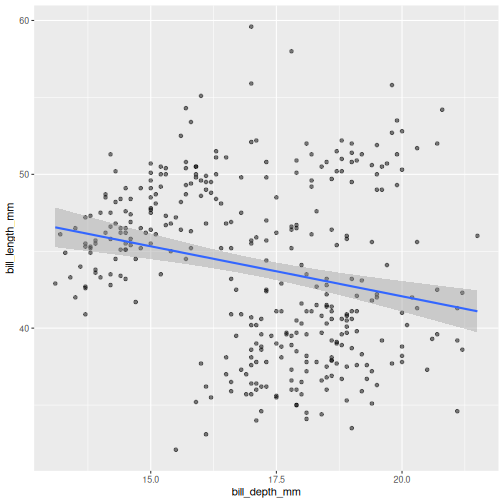

::::::::::::::::::::::::::::::::::::: challenge 

## Challenge 5
Modify the plot so the the points are coloured by island, but there is a single regression line.

:::::::::::::::::::::::::::::::::::::::: solution 

## Solution 


```r
ggplot(data = penguins, 
       mapping = aes(x = bill_depth_mm, 
                     y = bill_length_mm)) +
  geom_point(mapping = aes(colour = species),
             alpha = 0.5) +
  geom_smooth(method = "lm")
`geom_smooth()` using formula 'y ~ x'
Warning: Removed 2 rows containing non-finite values (stat_smooth).
Warning: Removed 2 rows containing missing values (geom_point).
```

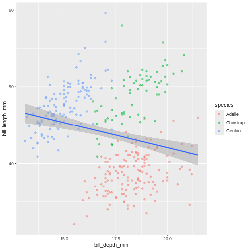
In the graph above, each geom inherited all three mappings: x, y and colour. If we want only single linear model to be built, we would need to limit the effect of `colour` aesthetic to only `geom_point()` function, by moving it from the "parent" function to the layer where we want it to apply. Note, though, that because we want the `colour` to be still mapped to the `island` variable, it needs to be wrapped into `aes()` function and supplied to `mapping` argument.
:::::::::::::::::::::::::::::::::::::::: 
::::::::::::::::::::::::::::::::::::: 

::::::::::::::::::::::::::::::::::::: challenge 
## Challenge 6
Add a regression line to the plot that plots one line for each species, while also plotting one across all species.

:::::::::::::::::::::::::::::::::::::::: hint
Add another geom!
:::::::::::::::::::::::::::::::::::::::: 

:::::::::::::::::::::::::::::::::::::::: solution 

## Solution 


```r
ggplot(penguins, 
       aes(x = bill_depth_mm, 
           y = bill_length_mm)) +
  geom_point(aes(colour = species),
             alpha = 0.5) +
  geom_smooth(method = "lm", 
              aes(colour = species)) +
  geom_smooth(method = "lm", 
              colour = "black")
`geom_smooth()` using formula 'y ~ x'
Warning: Removed 2 rows containing non-finite values (stat_smooth).
`geom_smooth()` using formula 'y ~ x'
Warning: Removed 2 rows containing non-finite values (stat_smooth).
Warning: Removed 2 rows containing missing values (geom_point).
```

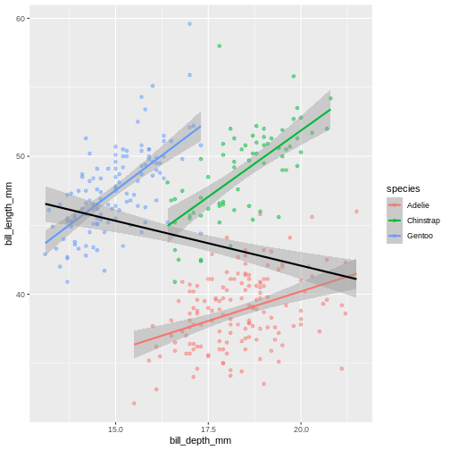
Look at that! The data actually reveals something called the "simpsons paradox". It's when a relationship looks to go in a specific direction, but when looking into groups within the data the relationship is the opposite. Here, the overall relationship between bill length and depths looks negative, but when we take into account that there are different species, the relationship is actually positive.

:::::::::::::::::::::::::::::::::::::::: 
::::::::::::::::::::::::::::::::::::: 


## Sub-plots (plot panels)

The last thing we will cover for plots is creating sub-plots.
Often, we'd like to create the same set of plots, but as distinctly different subplots.
This way, we dont need to map soo many aesthetics (it can end up being really messy).

Lets say, the last plot we made, we want to understand if there are also differences between male and female penguins.
In ggplot2, this is called a "facet", and the function we use is called either `facet_wrap` or `facet_grid`. 


```r
ggplot(penguins, 
      aes(x = bill_depth_mm, 
          y = bill_length_mm,
          colour = species)) +
  geom_point(alpha = 0.5) +
  geom_smooth(method = "lm") +
  facet_wrap(~ sex)
`geom_smooth()` using formula 'y ~ x'
Warning: Removed 2 rows containing non-finite values (stat_smooth).
Warning: Removed 2 rows containing missing values (geom_point).
```

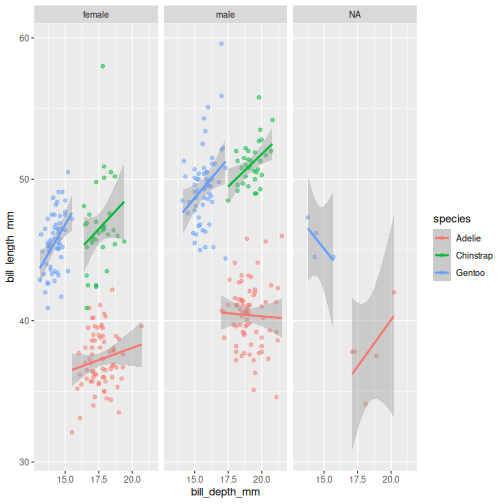

The facet's take formula arguments, meaning they contain the `tilde` (~).
The way often we think about it, trying to "read" the code, is that we facet "over" sex (in this case). 

This plot looks a little crazy though, as we have penguins with missing sex information getting their own panel, and really, it makes more sense to compare the sexes within each species rather than the other way around.
Let us swap the places of species and sex.


```r
ggplot(penguins, 
      aes(x = bill_depth_mm, 
          y = bill_length_mm,
          colour = sex)) +
  geom_point(alpha = 0.5) +
  geom_smooth(method = "lm") +
  facet_wrap(~ species)
`geom_smooth()` using formula 'y ~ x'
Warning: Removed 2 rows containing non-finite values (stat_smooth).
Warning: Removed 2 rows containing missing values (geom_point).
```

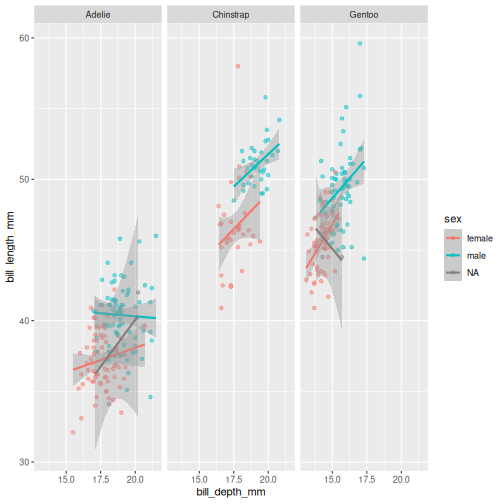

The NA's still look weird, but its definitely better, I think. 

::::::::::::::::::::::::::::::::::::: challenge 

## Challenge 7
To the plot we just made before, try adding another variable to facet by. For instance, facet by species and island.

:::::::::::::::::::::::::::::::::::::::: hint
Add another facet variable with the `+`
:::::::::::::::::::::::::::::::::::::::: 

:::::::::::::::::::::::::::::::::::::::: solution

## Solution 


```r
ggplot(penguins, 
      aes(x = bill_depth_mm, 
          y = bill_length_mm,
          colour = sex)) +
  geom_point(alpha = 0.5) +
  geom_smooth(method = "lm") +
  facet_wrap(~ species + island)
`geom_smooth()` using formula 'y ~ x'
Warning: Removed 2 rows containing non-finite values (stat_smooth).
Warning: Removed 2 rows containing missing values (geom_point).
```

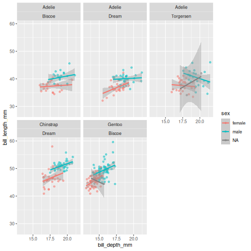

:::::::::::::::::::::::::::::::::::::::: 
::::::::::::::::::::::::::::::::::::: 

## Wrap-up

We learned about different parameters of ggplot functions, and how to combine different geoms into more complex charts.

