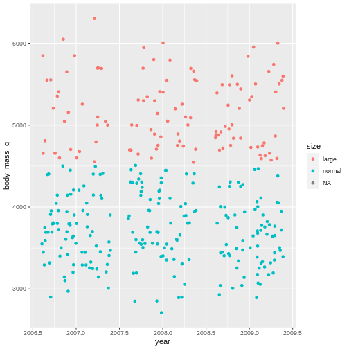

:::::::::::::::::::::::::::::::::::::: questions 

- How can I add variables to my data?
- How can I alter the variables already in my data?

::::::::::::::::::::::::::::::::::::::::::::::::

::::::::::::::::::::::::::::::::::::: objectives

- Use `mutate()` to add and alter variables
- Use `if_else()` where appropriate
- Use `case_when()` where appropriate
- Understand basic consents of different data types

::::::::::::::::::::::::::::::::::::::::::::::::

## Motivation

Often, the data we have do not contain exactly what we need. We might need to change the order of factors, create new variables based on other columns in the data, or even variables conditional on specific values in other columns. 


# Adding new variables,

In {tidyverse}, when we add new variables, we use the `mutate()` function. Just like the other {tidyverse} functions, mutate work specifically with data sets, and provides a nice shorthand for working directly with the columns in the data set. 


```r
penguins |> 
  mutate(new_var = 1)
```

```{.output}
# A tibble: 344 × 9
   species island    bill_length_mm bill_d…¹ flipp…² body_…³ sex    year new_var
   <fct>   <fct>              <dbl>    <dbl>   <int>   <int> <fct> <int>   <dbl>
 1 Adelie  Torgersen           39.1     18.7     181    3750 male   2007       1
 2 Adelie  Torgersen           39.5     17.4     186    3800 fema…  2007       1
 3 Adelie  Torgersen           40.3     18       195    3250 fema…  2007       1
 4 Adelie  Torgersen           NA       NA        NA      NA <NA>   2007       1
 5 Adelie  Torgersen           36.7     19.3     193    3450 fema…  2007       1
 6 Adelie  Torgersen           39.3     20.6     190    3650 male   2007       1
 7 Adelie  Torgersen           38.9     17.8     181    3625 fema…  2007       1
 8 Adelie  Torgersen           39.2     19.6     195    4675 male   2007       1
 9 Adelie  Torgersen           34.1     18.1     193    3475 <NA>   2007       1
10 Adelie  Torgersen           42       20.2     190    4250 <NA>   2007       1
# … with 334 more rows, and abbreviated variable names ¹​bill_depth_mm,
#   ²​flipper_length_mm, ³​body_mass_g
# ℹ Use `print(n = ...)` to see more rows
```

The output of this can be hard to spot, depending on the size of the screen.
Let us for convenience create a subsetted data set to work on so we can easily see what we are doing.


```r
penguins_s <- penguins |> 
  select(1:3, starts_with("bill"))
```

Lets try our command again on this new data.


```r
penguins_s |> 
  mutate(new_var = 1)
```

```{.output}
# A tibble: 344 × 5
   species island    bill_length_mm bill_depth_mm new_var
   <fct>   <fct>              <dbl>         <dbl>   <dbl>
 1 Adelie  Torgersen           39.1          18.7       1
 2 Adelie  Torgersen           39.5          17.4       1
 3 Adelie  Torgersen           40.3          18         1
 4 Adelie  Torgersen           NA            NA         1
 5 Adelie  Torgersen           36.7          19.3       1
 6 Adelie  Torgersen           39.3          20.6       1
 7 Adelie  Torgersen           38.9          17.8       1
 8 Adelie  Torgersen           39.2          19.6       1
 9 Adelie  Torgersen           34.1          18.1       1
10 Adelie  Torgersen           42            20.2       1
# … with 334 more rows
# ℹ Use `print(n = ...)` to see more rows
```

There is now a new column in the data set called "new_var", and it has the value 1 for all rows!
This is what we told `mutate()` to do! We specified a new column by name, and gave it a specific value, `1`. 

This works because its easy to assigning a single value to all rows. What if we try to give it three values? What would we expect?


```r
penguins_s |> 
  mutate(var = 1:3)
```

```{.error}
Error in `mutate()`:
! Problem while computing `var = 1:3`.
✖ `var` must be size 344 or 1, not 3.
```

Here, it's failing with a mysterious message. The error is telling us that input must be of size 344 or 1. 344 are the number of rows in the data set, so its telling us the input we gave it is not suitable because its neither of length 344 nor of length 1. 

So now we know the premises for mutate, it takes inputs that are either of the same length as there are rows in the data set or length 1. 

```r
penguins_s |> 
  mutate(var = 1:344)
```

```{.output}
# A tibble: 344 × 5
   species island    bill_length_mm bill_depth_mm   var
   <fct>   <fct>              <dbl>         <dbl> <int>
 1 Adelie  Torgersen           39.1          18.7     1
 2 Adelie  Torgersen           39.5          17.4     2
 3 Adelie  Torgersen           40.3          18       3
 4 Adelie  Torgersen           NA            NA       4
 5 Adelie  Torgersen           36.7          19.3     5
 6 Adelie  Torgersen           39.3          20.6     6
 7 Adelie  Torgersen           38.9          17.8     7
 8 Adelie  Torgersen           39.2          19.6     8
 9 Adelie  Torgersen           34.1          18.1     9
10 Adelie  Torgersen           42            20.2    10
# … with 334 more rows
# ℹ Use `print(n = ...)` to see more rows
```

But generally, we create new columns based on other data in the data set. So let's do a more useful example. For instance, perhaps we want to use the ratio between the bill length and depth as a measurement for a model.


```r
penguins_s |> 
  mutate(bill_ratio = bill_length_mm / bill_depth_mm)
```

```{.output}
# A tibble: 344 × 5
   species island    bill_length_mm bill_depth_mm bill_ratio
   <fct>   <fct>              <dbl>         <dbl>      <dbl>
 1 Adelie  Torgersen           39.1          18.7       2.09
 2 Adelie  Torgersen           39.5          17.4       2.27
 3 Adelie  Torgersen           40.3          18         2.24
 4 Adelie  Torgersen           NA            NA        NA   
 5 Adelie  Torgersen           36.7          19.3       1.90
 6 Adelie  Torgersen           39.3          20.6       1.91
 7 Adelie  Torgersen           38.9          17.8       2.19
 8 Adelie  Torgersen           39.2          19.6       2   
 9 Adelie  Torgersen           34.1          18.1       1.88
10 Adelie  Torgersen           42            20.2       2.08
# … with 334 more rows
# ℹ Use `print(n = ...)` to see more rows
```

So, here we have asked for the ratio between bill length and depth to be calculated and stored in a column named `bill_ratio`. Then we selected just the `bill` columns to have a peak at the output more directly. 

We can do almost anything within a `mutate()` to get the values as we want them, also use functions that exist in R to transform the data. For instance, perhaps we want to scale the variables of interest to have a mean of 0 and standard deviation of 1, which is quite common to improve statistical modelling. We can do that with the `scale()` function.


```r
penguins_s |> 
  mutate(bill_ratio = bill_length_mm / bill_depth_mm,
         bill_length_mm_z = scale(bill_length_mm))
```

```{.output}
# A tibble: 344 × 6
   species island    bill_length_mm bill_depth_mm bill_ratio bill_length_mm_z[…¹
   <fct>   <fct>              <dbl>         <dbl>      <dbl>               <dbl>
 1 Adelie  Torgersen           39.1          18.7       2.09              -0.883
 2 Adelie  Torgersen           39.5          17.4       2.27              -0.810
 3 Adelie  Torgersen           40.3          18         2.24              -0.663
 4 Adelie  Torgersen           NA            NA        NA                 NA    
 5 Adelie  Torgersen           36.7          19.3       1.90              -1.32 
 6 Adelie  Torgersen           39.3          20.6       1.91              -0.847
 7 Adelie  Torgersen           38.9          17.8       2.19              -0.920
 8 Adelie  Torgersen           39.2          19.6       2                 -0.865
 9 Adelie  Torgersen           34.1          18.1       1.88              -1.80 
10 Adelie  Torgersen           42            20.2       2.08              -0.352
# … with 334 more rows, and abbreviated variable name ¹​bill_length_mm_z[,1]
# ℹ Use `print(n = ...)` to see more rows
```

::::::::::::::::::::::::::::::::::::: challenge 
## Challenge 1
Create a column where bill length is transformed to cm. To transform mm to cm, you must divide the mm value by 10. Name the column bill_length_cm.

:::::::::::::::::::::::::::::::::::::::: solution 
## Solution


```r
penguins_s |>
  mutate(bill_length_cm = bill_length_mm / 10)
```

```{.output}
# A tibble: 344 × 5
   species island    bill_length_mm bill_depth_mm bill_length_cm
   <fct>   <fct>              <dbl>         <dbl>          <dbl>
 1 Adelie  Torgersen           39.1          18.7           3.91
 2 Adelie  Torgersen           39.5          17.4           3.95
 3 Adelie  Torgersen           40.3          18             4.03
 4 Adelie  Torgersen           NA            NA            NA   
 5 Adelie  Torgersen           36.7          19.3           3.67
 6 Adelie  Torgersen           39.3          20.6           3.93
 7 Adelie  Torgersen           38.9          17.8           3.89
 8 Adelie  Torgersen           39.2          19.6           3.92
 9 Adelie  Torgersen           34.1          18.1           3.41
10 Adelie  Torgersen           42            20.2           4.2 
# … with 334 more rows
# ℹ Use `print(n = ...)` to see more rows
```

:::::::::::::::::::::::::::::::::::::::: 
::::::::::::::::::::::::::::::::::::: 

::::::::::::::::::::::::::::::::::::: challenge 
## Challenge 2
Create a column for body mass in kilos, rather than grams, in the main penguins data set. Name the column body_mass_kg. To transform grams to kilograms, divide the grams by 1000. 

:::::::::::::::::::::::::::::::::::::::: solution 
## Solution


```r
penguins |>
  mutate(body_mass_kg = body_mass_g / 1000)
```

```{.output}
# A tibble: 344 × 9
   species island    bill_length_mm bill_d…¹ flipp…² body_…³ sex    year body_…⁴
   <fct>   <fct>              <dbl>    <dbl>   <int>   <int> <fct> <int>   <dbl>
 1 Adelie  Torgersen           39.1     18.7     181    3750 male   2007    3.75
 2 Adelie  Torgersen           39.5     17.4     186    3800 fema…  2007    3.8 
 3 Adelie  Torgersen           40.3     18       195    3250 fema…  2007    3.25
 4 Adelie  Torgersen           NA       NA        NA      NA <NA>   2007   NA   
 5 Adelie  Torgersen           36.7     19.3     193    3450 fema…  2007    3.45
 6 Adelie  Torgersen           39.3     20.6     190    3650 male   2007    3.65
 7 Adelie  Torgersen           38.9     17.8     181    3625 fema…  2007    3.62
 8 Adelie  Torgersen           39.2     19.6     195    4675 male   2007    4.68
 9 Adelie  Torgersen           34.1     18.1     193    3475 <NA>   2007    3.48
10 Adelie  Torgersen           42       20.2     190    4250 <NA>   2007    4.25
# … with 334 more rows, and abbreviated variable names ¹​bill_depth_mm,
#   ²​flipper_length_mm, ³​body_mass_g, ⁴​body_mass_kg
# ℹ Use `print(n = ...)` to see more rows
```

:::::::::::::::::::::::::::::::::::::::: 
::::::::::::::::::::::::::::::::::::: 


## Adding conditional variables

Sometimes, we want to assign certain data values based on other variables in the data set. 
For instance, maybe we want to classify all penguins with body mass above 4.5 kg as "large" while the rest are "normal"?

The `if_else()` function takes expressions, much like `filter()`.
The first value after the expression is the value assigned if the expression is `TRUE`, while the second is if the expression is `FALSE`


```r
penguin_weight <- penguins |> 
  select(year, body_mass_g)

penguin_weight |> 
  mutate(size = if_else(condition = body_mass_g > 4500, 
                        true = "large", 
                        false = "normal"))
```

```{.output}
# A tibble: 344 × 3
    year body_mass_g size  
   <int>       <int> <chr> 
 1  2007        3750 normal
 2  2007        3800 normal
 3  2007        3250 normal
 4  2007          NA <NA>  
 5  2007        3450 normal
 6  2007        3650 normal
 7  2007        3625 normal
 8  2007        4675 large 
 9  2007        3475 normal
10  2007        4250 normal
# … with 334 more rows
# ℹ Use `print(n = ...)` to see more rows
```

Now we have a column with two values, `large` and `normal` based on whether the penguins are above or below 4.5 kilos.

We can for instance use that in a plot.


```r
penguin_weight |> 
  mutate(size = if_else(condition = body_mass_g > 4500, 
                        true = "large", 
                        false = "normal")) |> 
  ggplot() +
  geom_jitter(mapping = aes(x = year, y = body_mass_g, colour = size))
```

```{.warning}
Warning: Removed 2 rows containing missing values (geom_point).
```



That shows us clearly that we have grouped the penguins based on their size. But there is this strange `NA` in the plot legend. what is that? 

In R, missing values are usually given the value `NA` which stands for `Not applicable`, *i.e.*, missing data. This is a very special name in R. Like `TRUE` and `FALSE` are capitalized, RStudio immediately recognizes the combination of capital letters and gives it another colour than all other values. In this case it means, there are some penguins we do not have the body mass of.

Now we know how to create new variables, and even how to make them if there are conditions on how to add the data.

But, we often want to add several columns of different types, and maybe even add new variables based on other new columns!
Oh, it's starting to sound complicated, but it does not have to be!

`mutate()` is so-called lazy-evaluated. This sounds weird, but it means that each new column you make is made in the sequence you make them. So as long as you think about the order of your `mutate()` creations, you can do that in a single mutate call.


```r
penguins_s |> 
  mutate(
    bill_ratio = bill_depth_mm / bill_length_mm,
    bill_type = if_else(condition = bill_ratio < 0.5, 
                        true = "elongated", 
                        false = "stumped")
  )
```

```{.output}
# A tibble: 344 × 6
   species island    bill_length_mm bill_depth_mm bill_ratio bill_type
   <fct>   <fct>              <dbl>         <dbl>      <dbl> <chr>    
 1 Adelie  Torgersen           39.1          18.7      0.478 elongated
 2 Adelie  Torgersen           39.5          17.4      0.441 elongated
 3 Adelie  Torgersen           40.3          18        0.447 elongated
 4 Adelie  Torgersen           NA            NA       NA     <NA>     
 5 Adelie  Torgersen           36.7          19.3      0.526 stumped  
 6 Adelie  Torgersen           39.3          20.6      0.524 stumped  
 7 Adelie  Torgersen           38.9          17.8      0.458 elongated
 8 Adelie  Torgersen           39.2          19.6      0.5   stumped  
 9 Adelie  Torgersen           34.1          18.1      0.531 stumped  
10 Adelie  Torgersen           42            20.2      0.481 elongated
# … with 334 more rows
# ℹ Use `print(n = ...)` to see more rows
```

Now you've created two variables. One for `bill_ratio`, and then another one conditional on the values of the `bill_ratio`.

If you switched the order of these two, R would produce an error, because there would be no bill ratio to create the other column.


```r
penguins_s |> 
  mutate(
    bill_ratio = bill_depth_mm / bill_length_mm,
    bill_type = if_else(condition = bill_ratio < 0.5, 
                        true = "elongated", 
                        false = "stumped"),
    bill_ratio = bill_depth_mm / bill_length_mm
  )
```

```{.output}
# A tibble: 344 × 6
   species island    bill_length_mm bill_depth_mm bill_ratio bill_type
   <fct>   <fct>              <dbl>         <dbl>      <dbl> <chr>    
 1 Adelie  Torgersen           39.1          18.7      0.478 elongated
 2 Adelie  Torgersen           39.5          17.4      0.441 elongated
 3 Adelie  Torgersen           40.3          18        0.447 elongated
 4 Adelie  Torgersen           NA            NA       NA     <NA>     
 5 Adelie  Torgersen           36.7          19.3      0.526 stumped  
 6 Adelie  Torgersen           39.3          20.6      0.524 stumped  
 7 Adelie  Torgersen           38.9          17.8      0.458 elongated
 8 Adelie  Torgersen           39.2          19.6      0.5   stumped  
 9 Adelie  Torgersen           34.1          18.1      0.531 stumped  
10 Adelie  Torgersen           42            20.2      0.481 elongated
# … with 334 more rows
# ℹ Use `print(n = ...)` to see more rows
```

But what if we want to categorize based on more than one condition? Nested `if_else()`?


```r
penguins_s |> 
  mutate(
    bill_ratio = bill_depth_mm / bill_length_mm,
    bill_type = if_else(condition = bill_ratio < 0.35,
                        true =  "elongated", 
                        false = if_else(condition = bill_ratio < 0.45,
                                        true = "normal",
                                        false = "stumped")))
```

```{.output}
# A tibble: 344 × 6
   species island    bill_length_mm bill_depth_mm bill_ratio bill_type
   <fct>   <fct>              <dbl>         <dbl>      <dbl> <chr>    
 1 Adelie  Torgersen           39.1          18.7      0.478 stumped  
 2 Adelie  Torgersen           39.5          17.4      0.441 normal   
 3 Adelie  Torgersen           40.3          18        0.447 normal   
 4 Adelie  Torgersen           NA            NA       NA     <NA>     
 5 Adelie  Torgersen           36.7          19.3      0.526 stumped  
 6 Adelie  Torgersen           39.3          20.6      0.524 stumped  
 7 Adelie  Torgersen           38.9          17.8      0.458 stumped  
 8 Adelie  Torgersen           39.2          19.6      0.5   stumped  
 9 Adelie  Torgersen           34.1          18.1      0.531 stumped  
10 Adelie  Torgersen           42            20.2      0.481 stumped  
# … with 334 more rows
# ℹ Use `print(n = ...)` to see more rows
```

what if you have even more conditionals? It can get pretty messy pretty fast.
Thankfully, {dplyr} has a smarter way of doing this, called `case_when()`. This function is similar to `if_else()`, but where you specify what each condition should be assigned.
On the left you have the logical expression, and the on the right of the tilde (`~`) is the value to be assigned if that expression is `TRUE`


```r
penguins_s |> 
  mutate(
    bill_ratio = bill_depth_mm / bill_length_mm,
    bill_type = case_when(
      bill_ratio < 0.35 ~ "elongated",
      bill_ratio < 0.45 ~ "normal",
      TRUE              ~ "stumped")
  ) |> 
  ggplot(mapping = aes(x = bill_length_mm,
                       y = bill_depth_mm,
                       colour = bill_type)) +
  geom_point()
```

```{.warning}
Warning: Removed 2 rows containing missing values (geom_point).
```


That looks almost the same. The `NA`'s are gone! That's not right. We cannot categorize values that are missing. It's our last statement that does this, which just says "make the remainder this value". Which is not what we want. We need the `NA`s to stay `NA`'s. 

`case_when()`, like the `mutate()`, evaluates the expressions in sequence. Which is why we can have two statements evaluating the same column with similar expressions (below 0.35 and then below 0.45). All values that are below 0.45 are also below 0.35. Since we first assign everything below 0.35, and then below 0.45, they do not collide. We can do the same for our last statement, saying that all values that are not `NA` should be given this category.


```r
penguins |> 
  mutate(
    bill_ratio = bill_depth_mm / bill_length_mm,
    bill_type = case_when(
      bill_ratio < 0.35  ~ "elongated",
      bill_ratio < 0.45  ~ "normal",
      !is.na(bill_ratio) ~ "stumped")
  ) |> 
  ggplot(mapping = aes(x = bill_length_mm,
                       y = bill_depth_mm,
                       colour = bill_type)) +
  geom_point()
```

```{.warning}
Warning: Removed 2 rows containing missing values (geom_point).
```


Here, we use the `is.na()`, which is a special function in R to detect `NA` values. But it also has an `!` in front, what does that mean? In R's logical expressions, the `!` is a negation specifier. It means it flips the logical so the `TRUE` becomes `FALSE`, and *vice versa*. So here, it means the `bill_ratio` is **not** `NA`.

::::::::::::::::::::::::::::::::::::: challenge 
## Challenge 3
Create a column named `bill_ld_ratio_log` that is the natural logarithm (using the `log()` function) of `bill_length_mm` divided by `bill_depth_mm`

:::::::::::::::::::::::::::::::::::::::: solution 
## Solution


```r
penguins |>
  mutate(bill_ld_ratio_log = log(bill_length_mm / bill_depth_mm))
```

```{.output}
# A tibble: 344 × 9
   species island    bill_length_mm bill_d…¹ flipp…² body_…³ sex    year bill_…⁴
   <fct>   <fct>              <dbl>    <dbl>   <int>   <int> <fct> <int>   <dbl>
 1 Adelie  Torgersen           39.1     18.7     181    3750 male   2007   0.738
 2 Adelie  Torgersen           39.5     17.4     186    3800 fema…  2007   0.820
 3 Adelie  Torgersen           40.3     18       195    3250 fema…  2007   0.806
 4 Adelie  Torgersen           NA       NA        NA      NA <NA>   2007  NA    
 5 Adelie  Torgersen           36.7     19.3     193    3450 fema…  2007   0.643
 6 Adelie  Torgersen           39.3     20.6     190    3650 male   2007   0.646
 7 Adelie  Torgersen           38.9     17.8     181    3625 fema…  2007   0.782
 8 Adelie  Torgersen           39.2     19.6     195    4675 male   2007   0.693
 9 Adelie  Torgersen           34.1     18.1     193    3475 <NA>   2007   0.633
10 Adelie  Torgersen           42       20.2     190    4250 <NA>   2007   0.732
# … with 334 more rows, and abbreviated variable names ¹​bill_depth_mm,
#   ²​flipper_length_mm, ³​body_mass_g, ⁴​bill_ld_ratio_log
# ℹ Use `print(n = ...)` to see more rows
```

:::::::::::::::::::::::::::::::::::::::: 
::::::::::::::::::::::::::::::::::::: 

::::::::::::::::::::::::::::::::::::: challenge 
## Challenge 4
Create a new column called `body_type`, where animals below 3 kg are `small`, animals between 3 and 4.5 kg are `normal`, and animals larger than 4.5 kg are `large`. In the same command, create a new column named `biscoe` and its content should be `TRUE` if the island is `Biscoe` and `FALSE` for everything else.

:::::::::::::::::::::::::::::::::::::::: solution 
## Solution


```r
penguins |>
  mutate(
    body_type = case_when(
       body_mass_g < 3000 ~ "small",
       body_mass_g >= 3000 & body_mass_g < 4500 ~ "normal",
       body_mass_g >= 4500 ~ "large"),
    biscoe = if_else(island == "Biscoe", 
                     true = TRUE,
                     false = FALSE)
  )
```

```{.output}
# A tibble: 344 × 10
   species island    bill_l…¹ bill_…² flipp…³ body_…⁴ sex    year body_…⁵ biscoe
   <fct>   <fct>        <dbl>   <dbl>   <int>   <int> <fct> <int> <chr>   <lgl> 
 1 Adelie  Torgersen     39.1    18.7     181    3750 male   2007 normal  FALSE 
 2 Adelie  Torgersen     39.5    17.4     186    3800 fema…  2007 normal  FALSE 
 3 Adelie  Torgersen     40.3    18       195    3250 fema…  2007 normal  FALSE 
 4 Adelie  Torgersen     NA      NA        NA      NA <NA>   2007 <NA>    FALSE 
 5 Adelie  Torgersen     36.7    19.3     193    3450 fema…  2007 normal  FALSE 
 6 Adelie  Torgersen     39.3    20.6     190    3650 male   2007 normal  FALSE 
 7 Adelie  Torgersen     38.9    17.8     181    3625 fema…  2007 normal  FALSE 
 8 Adelie  Torgersen     39.2    19.6     195    4675 male   2007 large   FALSE 
 9 Adelie  Torgersen     34.1    18.1     193    3475 <NA>   2007 normal  FALSE 
10 Adelie  Torgersen     42      20.2     190    4250 <NA>   2007 normal  FALSE 
# … with 334 more rows, and abbreviated variable names ¹​bill_length_mm,
#   ²​bill_depth_mm, ³​flipper_length_mm, ⁴​body_mass_g, ⁵​body_type
# ℹ Use `print(n = ...)` to see more rows
```

:::::::::::::::::::::::::::::::::::::::: 
::::::::::::::::::::::::::::::::::::: 


# Wrap up

Now we've learned a little about adding and altering variables in data sets using {dplyr}'s `mutate()` function. 
You should be able to play around with the examples provided and learn more about how things work through trial and error. 
