:::::::::::::::::::::::::::::::::::::: questions 

- How can I change the colour in my plots?
- How can I change the general look of my plot?

::::::::::::::::::::::::::::::::::::::::::::::::

::::::::::::::::::::::::::::::::::::: objectives

- Use `scale_fill_xxx()` and `scale_colour_xxx()` to change colours in your plot.
- Use the `theme()` functions to change the general look of your plot.

::::::::::::::::::::::::::::::::::::::::::::::::

## Motivation

Now that we know how to subset and re-arrange our data a little, its time to explore the data again in plots. 

Knowing how to apply what we know so far, with plotting, can help us create more exciting and informative plots.
Additionally, changing the colour and general look of the plot might be necessary to adapt to journal expectation or company branding.

# Piping into ggplot

Since we know about pipes, we should also explore how we can combine the pipes with 
ggplot, to reduce the data solely for the purpose of a plot, without changing the actual data. 
Perhaps you only want to plot the bill length of the males, to explore that data more directly.

::::::::::::::::::: instructor
When reading this part, read it as follows when typing:

> taking the penguins dataset, and then
> filter the rows so we only have male penguins, and then
> plot the data with ggplot, with bill length on the x-axis, and add
> a bar chart

::::::::::::::::::::::::::::::


```r
penguins |> 
  filter(sex == "male") |>
  ggplot(aes(bill_length_mm)) +
  geom_bar()
```

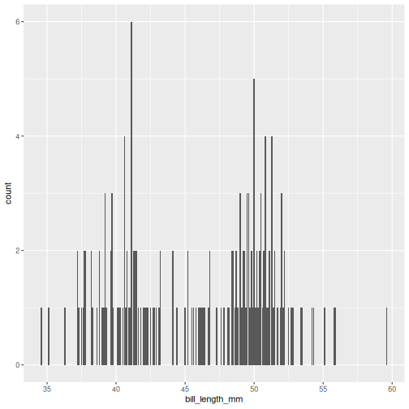

Now we only plot data from the male penguins, if we are particularly interested in those.
This can be quite convenient if you have particularly large data and need to reduce it to get a proper idea of what the variables really look like.

::::::::::::::::::::::::::::::::::::: challenge 
## Challenge 1
Create a plot of only data from the Dream island, putting flipper length on the y-axis and species on the x-axis. Make it a box-plot.

:::::::::::::::::::::::::::::::::::::::: hint
Try geom_boxplot
:::::::::::::::::::::::::::::::::::::::: 

:::::::::::::::::::::::::::::::::::::::: solution
## Solution


```r
penguins |> 
  filter(island == "Dream") |> 
  ggplot(aes(x = species, y = flipper_length_mm)) + 
  geom_boxplot()
```

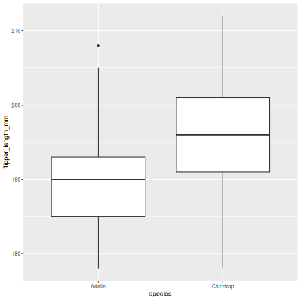
:::::::::::::::::::::::::::::::::::::::: 
::::::::::::::::::::::::::::::::::::: 

# Adding colour

This plot is a little boring, so let us spruce it up!
How about adding colour to the boxplot? 
We do this by using the `colour`/`color` argument in ggplot2.

::::::::::::::::::: instructor
When reading this part, read it as follows when typing:

> taking the penguins dataset, and then
> filter the rows so we penguins from the Dream island, and then
> plot the data with ggplot, with species on the x-axis and flipper length on the y-axis, and add
> a box plot

::::::::::::::::::::::::::::::


```r
penguins |> 
  filter(island == "Dream") |> 
  ggplot(aes(x = species, y = flipper_length_mm)) + 
  geom_boxplot(aes(colour = species))
```

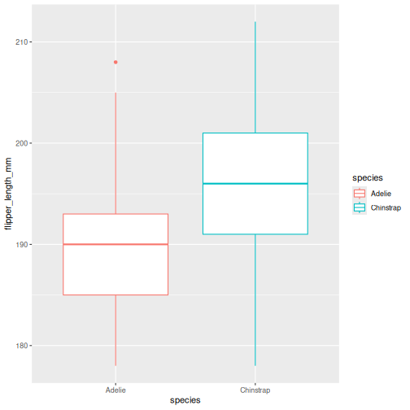

Did that look as you expected? 
Maybe you expected the rectangles of the boxes to be coloured, rather than the edges?

::::::::::::::::::::::::::::::::::::: challenge 
## Challenge 2
Change the previous boxplot argument `colour` to `fill` 

:::::::::::::::::::::::::::::::::::::::: solution
## Solution

Learning the difference between using `fill` and `colour`/`color` can take a little time,
but in general colour gives colour to edges, while fill floods elements.


```r
penguins |> 
  filter(island == "Dream") |> 
  ggplot(aes(x = species, y = flipper_length_mm)) + 
  geom_boxplot(aes(fill = species))
```

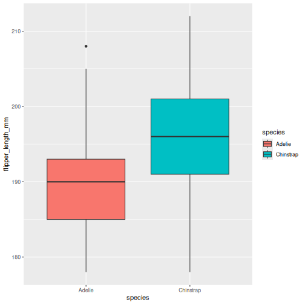
:::::::::::::::::::::::::::::::::::::::: 
::::::::::::::::::::::::::::::::::::: 


# Changing colour

Now, default colours are well and fine for quick plots and exploring data, but we usually all end up changing the colours when we start preparing for publication or reports. 
In ggplot, we change the colours using the `scale_`functions.
The scale functions actually cover much more than just colour/fill. 
They can change the types of points in point plots, different types of scales for the axes (logarithmic, percent, currency), and lots more! 
We will focus on colour/fill here, but once you start exploring these options, there are almost no limits to what you can do!

Let's say you are publishing in a journal with strict policy on black and white only.
Its better to prepare you  plot in back and white your self, rather than relying on conversion of colour to black and white, you might be surprised at how little distinction there are between colours when the actually colour is stripped.

Let us start with the plot we just made, and test what types of options we get when starting to add `scale_fill_` in the script. 
We get lots of preview options, "brewer", "continuous", "gradient", too many options?

There's one called `scale_fill_grey()` let us try that one for convenience!


```r
penguins |> 
  filter(island == "Dream") |> 
  ggplot(aes(x = species, y = flipper_length_mm)) + 
  geom_boxplot(aes(fill = species)) +
  scale_fill_grey()
```

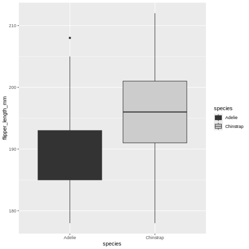

Ok! The colours are now changed, and the legend with it, quite convenient.
But, the grey used is the same as for the lines, masking the median line for the Adelie box.
That won't do. Let us try something else.


```r
penguins |> 
  filter(island == "Dream") |> 
  ggplot(aes(x = species, y = flipper_length_mm)) + 
  geom_boxplot(aes(fill = species)) +
  scale_fill_manual(values = c("black", "white"))
```

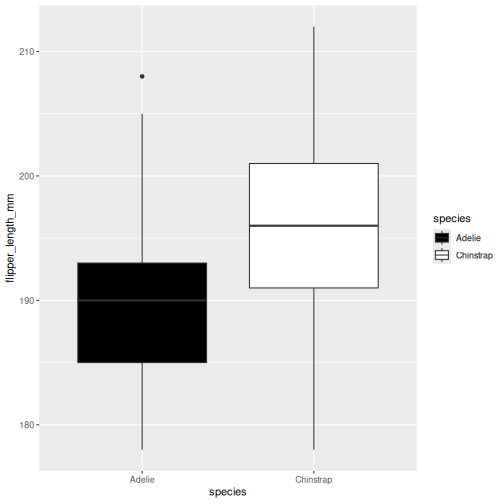

This is maybe a little stark, but the difference is clear between the two, and that's what we are after right now.
Using the `manual` version of scales means you manually add the colours you want to use. 
You can specify colours by name and hexidecimal code, whichever you find better to work with.

::::::::::::::::::::::::::::::::::::: challenge 
## Challenge 3
Base you plot on the same as we have used so far.
Change the colours to coral and cyan

:::::::::::::::::::::::::::::::::::::::: solution
## Solution

"coral" and "cyan" are built in colour names, that you can call directly. 
There are lots of these names, [datanovia](https://www.datanovia.com/en/blog/awesome-list-of-657-r-color-names/) has a great list of them


```r
penguins |> 
  filter(island == "Dream") |> 
  ggplot(aes(x = species, y = flipper_length_mm)) + 
  geom_boxplot(aes(fill = species)) +
  scale_fill_manual(values = c("coral", "cyan"))
```

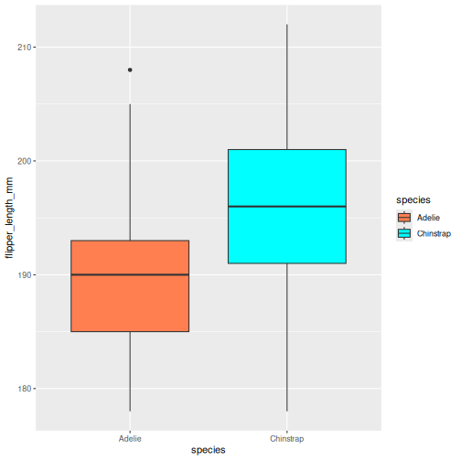
:::::::::::::::::::::::::::::::::::::::: 
::::::::::::::::::::::::::::::::::::: 

::::::::::::::::::::::::::::::::::::: challenge 
## Challenge 4
Base you plot on the same as we have used so far.
Change the colours to the hexidecmial colours "#6597aa" and "#cc6882"

:::::::::::::::::::::::::::::::::::::::: solution
## Solution

hexidecimal colour codes are often use in webdesign, and are a way of coding 
red, blue and green. To explore colours in hexidecmial, there are lots of we resources
like [color-hex.com](https://www.color-hex.com/)


```r
penguins |> 
  filter(island == "Dream") |> 
  ggplot(aes(x = species, y = flipper_length_mm)) + 
  geom_boxplot(aes(fill = species)) +
  scale_fill_manual(values = c("#6597aa", "#cc6882"))
```

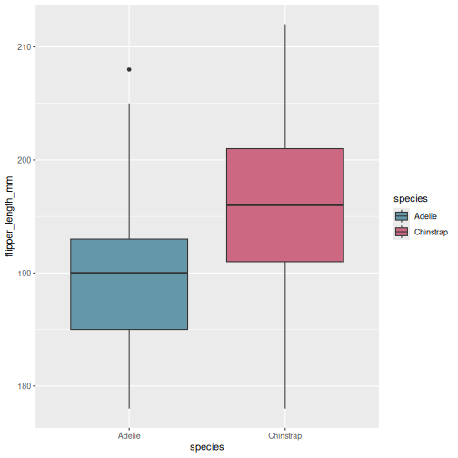
:::::::::::::::::::::::::::::::::::::::: 
::::::::::::::::::::::::::::::::::::: 

::::::::::::::::::::::::::::::::::::: challenge 
## Challenge 5
Base you plot on the same as we have used so far.
Change the order for the hexidecimal colours in the previous plot.
what did that do?

:::::::::::::::::::::::::::::::::::::::: solution
## Solution

The order you provide the manual colours dictate which category gets which colour.


```r
penguins |> 
  filter(island == "Dream") |> 
  ggplot(aes(x = species, y = flipper_length_mm)) + 
  geom_boxplot(aes(fill = species)) +
  scale_fill_manual(values = c("#cc6882", "#6597aa"))
```

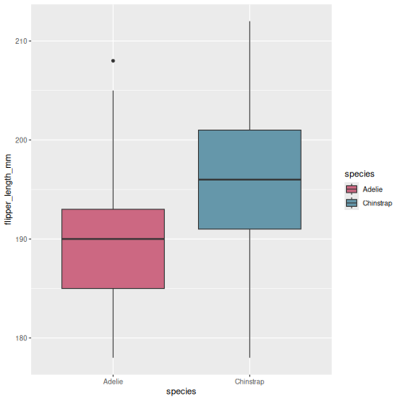
:::::::::::::::::::::::::::::::::::::::: 
::::::::::::::::::::::::::::::::::::: 


::::::::::::::::::::::::::::::::::::: challenge 
## Challenge 6
Now, make an entirely different plot. Take the entire penguins dataset,
and plot bill depth on the x-axis and bill length on the y.
Create a point plot, with the points coloured by bill length.
Try changing the colour of the points. What types of scales can you use?


:::::::::::::::::::::::::::::::::::::::: solution
## Solution

There is not single answer here, there are many different options.
The key difference between what we did before and this, is that the colouring scale
is continuous, rather than categorical, so we need _slightly_ different versions.


```r
penguins |> 
  ggplot(aes(x = bill_depth_mm, y = bill_length_mm)) + 
  geom_point(aes(colour = bill_length_mm)) +
  scale_colour_viridis_c()
```

```{.warning}
Warning: Removed 2 rows containing missing values (`geom_point()`).
```

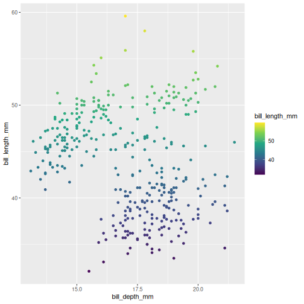


```r
penguins |> 
  ggplot(aes(x = bill_depth_mm, y = bill_length_mm)) + 
  geom_point(aes(colour = bill_length_mm)) +
  scale_colour_gradientn(colours = c("#6597aa", "#cc6882"))
```

```{.warning}
Warning: Removed 2 rows containing missing values (`geom_point()`).
```

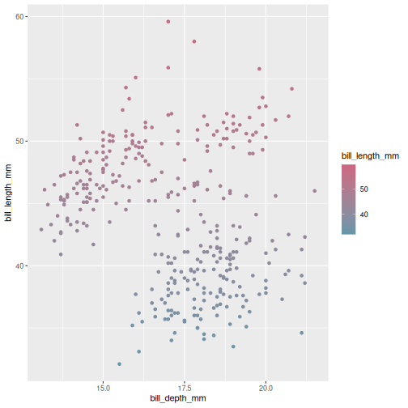

:::::::::::::::::::::::::::::::::::::::: 
::::::::::::::::::::::::::::::::::::: 


# Changing the overall look

Now that we know more about changing the colours, we might want something else than the default look with the grey background etc. Just like with the default colours, it serves its generally quick look purpose, but we likely want to change it.

The `theme()` functions are there to help you get control over how a plot looks. 
There are lots of different themes to choose from, that form a great basis for all you need.


```r
penguins |> 
  ggplot(aes(x = bill_depth_mm, y = bill_length_mm)) + 
  geom_point(aes(colour = bill_length_mm)) +
  scale_colour_gradientn(colours = c("#6597aa", "#cc6882")) +
  theme_minimal()
```

```{.warning}
Warning: Removed 2 rows containing missing values (`geom_point()`).
```


Here we have chosen `theme_minimal()` which strips axis lines and the grey background, its more minimal. 
Explore some different options by typing `theme_` and pressing the `tab` key to see what options there are.

::::::::::::::::::::::::::::::::::::: challenge 
## Challenge 7
Use the same plot we have been working on, and change the theme to the "classic theme


:::::::::::::::::::::::::::::::::::::::: solution
## Solution

The classic theme is one often wanted by strict and old-school journals. 
Its very handy to have a short-cut to it.


```r
penguins |> 
  ggplot(aes(x = bill_depth_mm, y = bill_length_mm)) + 
  geom_point(aes(colour = bill_length_mm)) +
  scale_colour_gradientn(colours = c("#6597aa", "#cc6882")) +
  theme_classic()
```

```{.warning}
Warning: Removed 2 rows containing missing values (`geom_point()`).
```

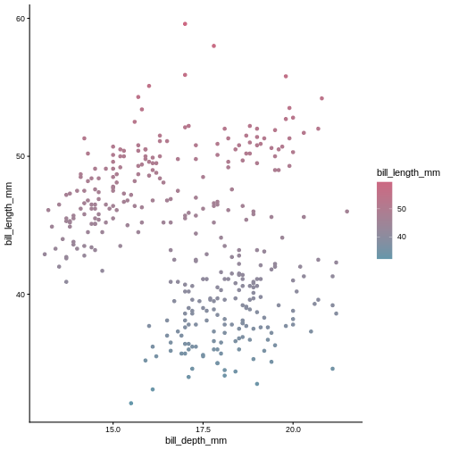

:::::::::::::::::::::::::::::::::::::::: 
::::::::::::::::::::::::::::::::::::: 

::::::::::::::::::::::::::::::::::::: challenge 
## Challenge 8
Now try the void theme. Is this a meaningful theme to use for data plots=

:::::::::::::::::::::::::::::::::::::::: solution
## Solution

The void theme strips all axis and background, leaving the plot alone.
This is generally not a meaningful theme to use for publication, but could
be good to use if you ever dwelve into the world of [generative art](https://blog.djnavarro.net/posts/2021-10-19_rtistry-posts/).


```r
penguins |> 
  ggplot(aes(x = bill_depth_mm, y = bill_length_mm)) + 
  geom_point(aes(colour = bill_length_mm)) +
  scale_colour_gradientn(colours = c("#6597aa", "#cc6882")) +
  theme_void()
```

```{.warning}
Warning: Removed 2 rows containing missing values (`geom_point()`).
```

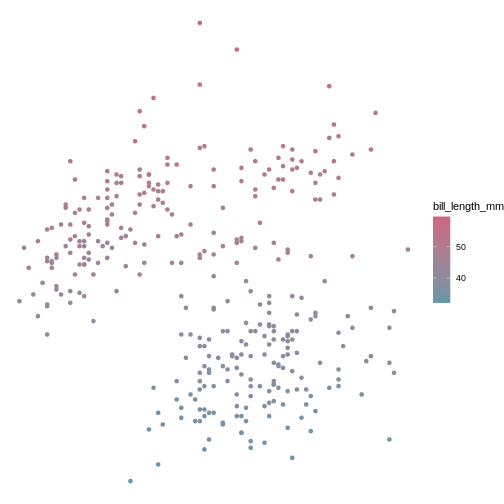

:::::::::::::::::::::::::::::::::::::::: 
::::::::::::::::::::::::::::::::::::: 


# Wrap up

There is a lot more we could teach you about customising your plots to look how you want. 
There are many web resources you can look at to help you along they way, like on [The MockUp](https://themockup.blog/posts/2020-12-26-creating-and-using-custom-ggplot2-themes/).
But if you dont want to deal with too many details, you can always isntall and use tne [ggthemes](https://jrnold.github.io/ggthemes/reference/index.html) package, which can create
plots that look like your old favourite tools made them (like SPSS, Stata, excel. etc.).
