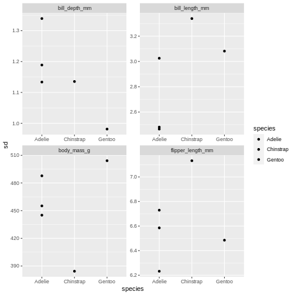
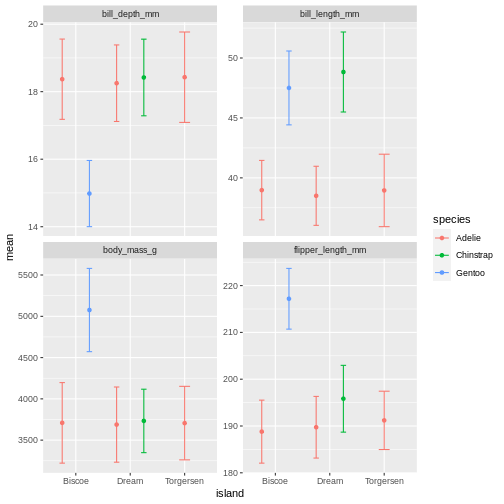
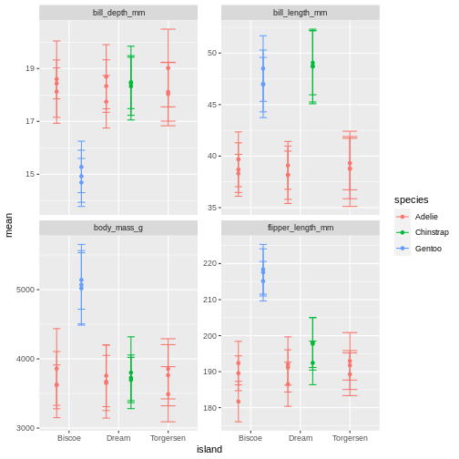
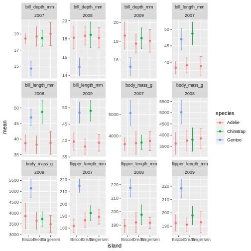
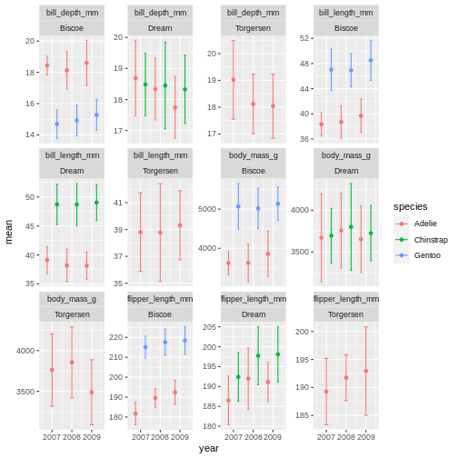
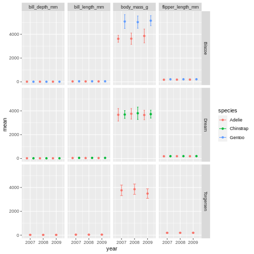
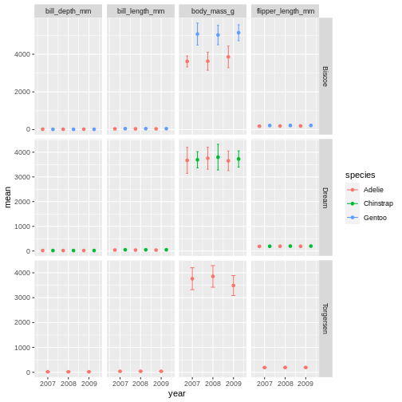
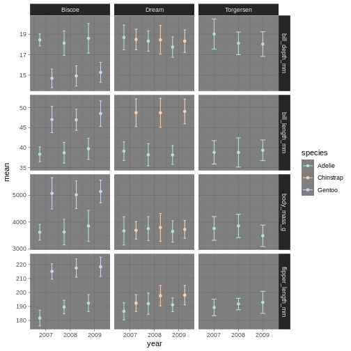

:::::::::::::::::::::::::::::::::::::: questions 

- How can I combine everything I've learned so far?
- How can I get my data into a wider format?

::::::::::::::::::::::::::::::::::::::::::::::::

::::::::::::::::::::::::::::::::::::: objectives

- To be able to combine the different functions we have covered in tandem to create seamless chains of data handling
- Creating custom, complex data summaries
- Creating complex plots with grids of subplots

::::::::::::::::::::::::::::::::::::::::::::::::

# Motivation
This session is going to be a little different than the others. 
We will be working with more challenges and exploring different way of combining the things we have learned these days.

Before the break, and a little scattered through the sessions, we have been combining the things we have learned. 
It's when we start using the tidyverse as a whole, all functions together that they start really becoming powerful.
In this last session, we will be working on the things we have learned and applying them together in ways that uncover some of the cool things we can get done.

Lets say we want to summarise _all_ the measurement variables, i.e. all the columns containing "_". 
We've learned about summaries and grouped summaries. 
Can you think of a way we can do that using the things we've learned?


```r
penguins |> 
  pivot_longer(contains("_"))
```

```{.output}
# A tibble: 1,376 × 6
   species island    sex     year name               value
   <fct>   <fct>     <fct>  <int> <chr>              <dbl>
 1 Adelie  Torgersen male    2007 bill_length_mm      39.1
 2 Adelie  Torgersen male    2007 bill_depth_mm       18.7
 3 Adelie  Torgersen male    2007 flipper_length_mm  181  
 4 Adelie  Torgersen male    2007 body_mass_g       3750  
 5 Adelie  Torgersen female  2007 bill_length_mm      39.5
 6 Adelie  Torgersen female  2007 bill_depth_mm       17.4
 7 Adelie  Torgersen female  2007 flipper_length_mm  186  
 8 Adelie  Torgersen female  2007 body_mass_g       3800  
 9 Adelie  Torgersen female  2007 bill_length_mm      40.3
10 Adelie  Torgersen female  2007 bill_depth_mm       18  
# … with 1,366 more rows
# ℹ Use `print(n = ...)` to see more rows
```

We've done this before, why is it a clue now? Now that we have learned grouping and summarising, 
what if we now also group by the new name column to get summaries for each column as a row already here!


```r
penguins |> 
  pivot_longer(contains("_")) |> 
  group_by(name) |> 
  summarise(mean = mean(value, na.rm = TRUE))
```

```{.output}
# A tibble: 4 × 2
  name                mean
  <chr>              <dbl>
1 bill_depth_mm       17.2
2 bill_length_mm      43.9
3 body_mass_g       4202. 
4 flipper_length_mm  201. 
```
Now we are talking! Now we have the mean of each of our observational columns! Lets add other common summary statistics.


```r
penguins |> 
  pivot_longer(contains("_")) |> 
  group_by(name) |> 
  summarise(
    mean = mean(value, na.rm = TRUE),
    sd = sd(value, na.rm = TRUE),
    min = min(value, na.rm = TRUE),
    max = max(value, na.rm = TRUE)
  )
```

```{.output}
# A tibble: 4 × 5
  name                mean     sd    min    max
  <chr>              <dbl>  <dbl>  <dbl>  <dbl>
1 bill_depth_mm       17.2   1.97   13.1   21.5
2 bill_length_mm      43.9   5.46   32.1   59.6
3 body_mass_g       4202.  802.   2700   6300  
4 flipper_length_mm  201.   14.1   172    231  
```

That's a pretty neat table! The repetition of `na.rm = TRUE` in all is a little tedious, though. Let us use an extra argument in the pivot longer to remove `NA`s in the value column


```r
penguins |> 
  pivot_longer(contains("_")) |>
  drop_na(value) |> 
  group_by(name) |> 
  summarise(
    mean = mean(value),
    sd = sd(value),
    min = min(value),
    max = max(value)
  )
```

```{.output}
# A tibble: 4 × 5
  name                mean     sd    min    max
  <chr>              <dbl>  <dbl>  <dbl>  <dbl>
1 bill_depth_mm       17.2   1.97   13.1   21.5
2 bill_length_mm      43.9   5.46   32.1   59.6
3 body_mass_g       4202.  802.   2700   6300  
4 flipper_length_mm  201.   14.1   172    231  
```

Now we have a pretty decent summary table of our data. 

::::::::::::::::::::::::::::::::::::: challenge 
## Challenge 1
In our code making the summary table. Add another summary column for the number of records, giving it the name `n`.

:::::::::::::::::::::::::::::::::::::::: hint
Try the `n()` function.
:::::::::::::::::::::::::::::::::::::::: 

:::::::::::::::::::::::::::::::::::::::: solution 
## Solution


```r
penguins |> 
  pivot_longer(contains("_")) |> 
  drop_na(value) |> 
  group_by(name) |> 
  summarise(
    mean = mean(value),
    sd   = sd(value),
    min  = min(value),
    max  = max(value),
    n = n()
  )
```

```{.output}
# A tibble: 4 × 6
  name                mean     sd    min    max     n
  <chr>              <dbl>  <dbl>  <dbl>  <dbl> <int>
1 bill_depth_mm       17.2   1.97   13.1   21.5   342
2 bill_length_mm      43.9   5.46   32.1   59.6   342
3 body_mass_g       4202.  802.   2700   6300     342
4 flipper_length_mm  201.   14.1   172    231     342
```

:::::::::::::::::::::::::::::::::::::::: 
::::::::::::::::::::::::::::::::::::: 

::::::::::::::::::::::::::::::::::::: challenge 

## Challenge 2
Try grouping by more variables, like species and island, is the output what you would expect it to be?

:::::::::::::::::::::::::::::::::::::::: solution 
## Solution


```r
penguins |> 
  pivot_longer(contains("_")) |> 
  drop_na(value) |> 
  group_by(name, species, island) |> 
  summarise(
    mean = mean(value),
    sd   = sd(value),
    min  = min(value),
    max  = max(value),
    n = n()
  )
```

```{.output}
`summarise()` has grouped output by 'name', 'species'. You can override using
the `.groups` argument.
```

```{.output}
# A tibble: 20 × 8
# Groups:   name, species [12]
   name              species   island      mean      sd    min    max     n
   <chr>             <fct>     <fct>      <dbl>   <dbl>  <dbl>  <dbl> <int>
 1 bill_depth_mm     Adelie    Biscoe      18.4   1.19    16     21.1    44
 2 bill_depth_mm     Adelie    Dream       18.3   1.13    15.5   21.2    56
 3 bill_depth_mm     Adelie    Torgersen   18.4   1.34    15.9   21.5    51
 4 bill_depth_mm     Chinstrap Dream       18.4   1.14    16.4   20.8    68
 5 bill_depth_mm     Gentoo    Biscoe      15.0   0.981   13.1   17.3   123
 6 bill_length_mm    Adelie    Biscoe      39.0   2.48    34.5   45.6    44
 7 bill_length_mm    Adelie    Dream       38.5   2.47    32.1   44.1    56
 8 bill_length_mm    Adelie    Torgersen   39.0   3.03    33.5   46      51
 9 bill_length_mm    Chinstrap Dream       48.8   3.34    40.9   58      68
10 bill_length_mm    Gentoo    Biscoe      47.5   3.08    40.9   59.6   123
11 body_mass_g       Adelie    Biscoe    3710.  488.    2850   4775      44
12 body_mass_g       Adelie    Dream     3688.  455.    2900   4650      56
13 body_mass_g       Adelie    Torgersen 3706.  445.    2900   4700      51
14 body_mass_g       Chinstrap Dream     3733.  384.    2700   4800      68
15 body_mass_g       Gentoo    Biscoe    5076.  504.    3950   6300     123
16 flipper_length_mm Adelie    Biscoe     189.    6.73   172    203      44
17 flipper_length_mm Adelie    Dream      190.    6.59   178    208      56
18 flipper_length_mm Adelie    Torgersen  191.    6.23   176    210      51
19 flipper_length_mm Chinstrap Dream      196.    7.13   178    212      68
20 flipper_length_mm Gentoo    Biscoe     217.    6.48   203    231     123
```

:::::::::::::::::::::::::::::::::::::::: 
::::::::::::::::::::::::::::::::::::: 

::::::::::::::::::::::::::::::::::::: challenge 
## Challenge 3
Create another summary table, with the same descriptive statistics (mean, sd ,min,max and n), 
but for all numerical variables. Grouped only by the variable names.

:::::::::::::::::::::::::::::::::::::::: solution 
## Solution


```r
penguins |> 
  pivot_longer(where(is.numeric)) |> 
  drop_na(value) |> 
  group_by(name) |> 
  summarise(
    mean = mean(value),
    sd   = sd(value),
    min  = min(value),
    max  = max(value),
    n = n()
  )
```

```{.output}
# A tibble: 5 × 6
  name                mean      sd    min    max     n
  <chr>              <dbl>   <dbl>  <dbl>  <dbl> <int>
1 bill_depth_mm       17.2   1.97    13.1   21.5   342
2 bill_length_mm      43.9   5.46    32.1   59.6   342
3 body_mass_g       4202.  802.    2700   6300     342
4 flipper_length_mm  201.   14.1    172    231     342
5 year              2008.    0.818 2007   2009     344
```

::::::::::::::::::::::::::::::::::::::::
::::::::::::::::::::::::::::::::::::: 


## Plotting summaries

Now that we have the summaries, we can use them in plots too! But keep typing or copying the same code over and over is tedious. 
So let us save the summary in its own object, and keep using that.


```r
penguins_sum <- penguins |> 
  pivot_longer(contains("_")) |> 
  drop_na(value) |> 
  group_by(name, species, island) |> 
  summarise(
    mean = mean(value),
    sd   = sd(value),
    min  = min(value),
    max  = max(value),
    n = n()
  ) |> 
  ungroup()
```

```{.output}
`summarise()` has grouped output by 'name', 'species'. You can override using
the `.groups` argument.
```

We can for instance make a bar chart with the values from the summary statistics.


```r
penguins_sum |> 
  ggplot(aes(x = island,
             y = mean,
             colour = species)) +
  geom_point() +
  facet_wrap(~ name, scales = "free_y")
```


oh, but the points are stacking on top of each other and are hard to see. T


```r
penguins_sum |> 
  ggplot(aes(x = island,
             y = mean,
             colour = species)) +
  geom_point(position = position_dodge(width = 1)) +
  facet_wrap(~ name, scales = "free_y")
```


That is starting to look like something nice.
What position_dodge is doing, is move the dts to each side a little, so they are not directly on top of each other, but you can still see them and which island they belong to clearly.

::::::::::::::::::::::::::::::::::::: challenge 
## Challenge 4
Create a point plot based om the penguins summary data, where the standard deviations are on the y axis and species are on the x axis. 
Make sure to dodge the bar for easier comparisons. 
Create subplots on the different observational types 

:::::::::::::::::::::::::::::::::::::::: hint
Use facet_wrap()
:::::::::::::::::::::::::::::::::::::::: 

:::::::::::::::::::::::::::::::::::::::: solution 
## Solution


```r
penguins_sum |> 
  ggplot(aes(x = island, 
             y = sd,
             fill = species)) +
  geom_point(position = position_dodge(width = 1)) +
  facet_wrap(~ name)
```


:::::::::::::::::::::::::::::::::::::::: 
::::::::::::::::::::::::::::::::::::: 

::::::::::::::::::::::::::::::::::::: challenge 
## Challenge 5
Change it so that species is both on the x-axis and the colour for the bar chart, and remove the dodge. 
What argument do you need to add to `facet_wrap()` to make the y-axis scale vary freely between the subplots? 
Why is this plot misleading?

:::::::::::::::::::::::::::::::::::::::: solution 
## Solution


```r
penguins_sum |> 
  ggplot(aes(x = species, 
             y = sd,
             fill = species)) +
  geom_point(position = position_dodge(width = 1)) +
  facet_wrap(~ name, scales = "free")
```


The last plot is misleading because the data we have summary data by species and island. 
Ignoring the island in the plot, means that the values for the different measurements cannot be distinguished from eachother.

:::::::::::::::::::::::::::::::::::::::: 
::::::::::::::::::::::::::::::::::::: 


A common thing to add to this type of plot, is the confidence intervals, or the error bars. This is calculated by the standard error, which we dont have, but for the sake of showing how to add error bars, we will use the standard deviation in stead.

To do that, we add the `geom_errorbar()` function to the ggplot calls. `geom_errorbar` is a little different than other geoms we have seen, it takes very specific arguments, namely the minimum and maximum value the error bars should span.
In our case, it would be the mean - sd, for minimum, and the mean + sd for the maximum.


```r
penguins_sum |> 
  ggplot(aes(x = island,
             y = mean,
             colour = species)) +
  geom_point(position = position_dodge(width = 1)) +
  geom_errorbar(aes(
    ymin = mean - sd,
    ymax = mean + sd
  )) +
  facet_wrap(~ name, scales = "free_y")
```


Right, so now we have error bars, but they dont connect to the dots!
Perhaps we can dodge those too?


```r
penguins_sum |> 
  ggplot(aes(x = island,
             y = mean,
             colour = species)) +
  geom_point(position = position_dodge(width = 1)) +
  geom_errorbar(aes(
    ymin = mean - sd,
    ymax = mean + sd
  ),
  position = position_dodge(width = 1)) +
  facet_wrap(~ name, scales = "free_y")
```


::::::::::::::::::::::::::::::::::::: challenge 
## Challenge 6
The width of the top horizontal lines in the error bars are are little too wide.
Try adjusting them by setting the width argument to 0.3

:::::::::::::::::::::::::::::::::::::::: solution 
## Solution


```r
penguins_sum |> 
  ggplot(aes(x = island,
             y = mean,
             colour = species)) +
  geom_point(position = position_dodge(width = 1)) +
  geom_errorbar(aes(
    ymin = mean - sd,
    ymax = mean + sd
  ),
  position = position_dodge(width = 1),
  width = .2) +
  facet_wrap(~ name, scales = "free_y")
```



:::::::::::::::::::::::::::::::::::::::: 
::::::::::::::::::::::::::::::::::::: 

## Facetting as a grid

But we can get even more creative! 
Lets recreate our summary table, and add year as a grouping, so we can get an idea of how the measurements change over time.


```r
penguins_sum <- penguins |> 
  pivot_longer(contains("_")) |> 
  drop_na(value) |> 
  group_by(name, species, island, year) |> 
  summarise(
    mean = mean(value),
    sd   = sd(value),
    min  = min(value),
    max  = max(value),
    n = n()
  ) |> 
  ungroup()
```

```{.output}
`summarise()` has grouped output by 'name', 'species', 'island'. You can
override using the `.groups` argument.
```

```r
penguins_sum
```

```{.output}
# A tibble: 60 × 9
   name          species   island     year  mean    sd   min   max     n
   <chr>         <fct>     <fct>     <int> <dbl> <dbl> <dbl> <dbl> <int>
 1 bill_depth_mm Adelie    Biscoe     2007  18.4 0.585  17.2  19.2    10
 2 bill_depth_mm Adelie    Biscoe     2008  18.1 1.20   16.2  21.1    18
 3 bill_depth_mm Adelie    Biscoe     2009  18.6 1.44   16    20.7    16
 4 bill_depth_mm Adelie    Dream      2007  18.7 1.21   16.7  21.2    20
 5 bill_depth_mm Adelie    Dream      2008  18.3 0.993  16.1  20.3    16
 6 bill_depth_mm Adelie    Dream      2009  17.7 0.994  15.5  20.1    20
 7 bill_depth_mm Adelie    Torgersen  2007  19.0 1.47   17.1  21.5    19
 8 bill_depth_mm Adelie    Torgersen  2008  18.1 1.11   16.1  19.4    16
 9 bill_depth_mm Adelie    Torgersen  2009  18.0 1.20   15.9  20.5    16
10 bill_depth_mm Chinstrap Dream      2007  18.5 1.00   16.6  20.3    26
# … with 50 more rows
# ℹ Use `print(n = ...)` to see more rows
```

And then let us re-create our last plot with this new summary table.


```r
penguins_sum |> 
  ggplot(aes(x = island,
             y = mean,
             colour = species)) +
  geom_point(position = position_dodge(width = 1)) +
  geom_errorbar(aes(
    ymin = mean - sd,
    ymax = mean + sd
  ),
  width = 0.3,
  position = position_dodge(width = 1)) +
  facet_wrap(~ name, scales = "free_y")
```



What is happening here?
Because we've now added year to the groups in the summary, we have multiple means per species and island, for each of the measurement years.
So we need to add something to the plot so we can tease those appart.
We have added to variables to the facet before. 
Remember how we did that?

::::::::::::::::::::::::::::::::::::: challenge 
## Challenge 7
The width of the top horizontal lines in the error bars are are little too wide.
Try adjusting them by setting the width argument to 0.3

:::::::::::::::::::::::::::::::::::::::: solution 
## Solution


```r
penguins_sum |> 
  ggplot(aes(x = island,
             y = mean,
             colour = species)) +
  geom_point(position = position_dodge(width = 1)) +
  geom_errorbar(aes(
    ymin = mean - sd,
    ymax = mean + sd
  ),
  position = position_dodge(width = 1),
  width = .2) +
  facet_wrap(~ name + year, scales = "free_y")
```



:::::::::::::::::::::::::::::::::::::::: 
::::::::::::::::::::::::::::::::::::: 

OK, so now we have it all. But its a little messy to compare over time, and what are we really looking at?
I find it often makes more sense to plot time variables on the x-axis, and then facets over categories. 
Lets switch that up.


```r
penguins_sum |> 
  ggplot(aes(x = year,
             y = mean,
             colour = species)) +
  geom_point(position = position_dodge(width = 1)) +
  geom_errorbar(aes(
    ymin = mean - sd,
    ymax = mean + sd
  ),
  position = position_dodge(width = 1),
  width = .2) +
  facet_wrap(~ name + island, scales = "free_y")
```


ok, so we got what we asked, the year part makes more sense, but its a very "busy" plot.
Its really quite hard to compare everything from Bisoe, or all the Adelie's, to each other.
How can we make it easier?

We will switch `facet_wrap()` to `facet_grid()` which creates a grid of subplots. 
The formula for the grid is using both side of the `~` sign. 
And you can think of it like `rows ~ columns`.
So here we are saying we want the `island` values as rows, and `name` values as columns in the plot grid.


```r
penguins_sum |> 
  ggplot(aes(x = year,
             y = mean,
             colour = species)) +
  geom_point(position = position_dodge(width = 1)) +
  geom_errorbar(aes(
    ymin = mean - sd,
    ymax = mean + sd
  ),
  position = position_dodge(width = 1),
  width = .2) +
  facet_grid(island ~ name)
```



::::::::::::::::::::::::::::::::::::: challenge 
## Challenge 8
It is hard to see the different metrics in the subplots, because they are all on such different scales. 
Try setting the y-axis to be set freely to allow differences betweem the subplots. 
Was this the effect you expected?

:::::::::::::::::::::::::::::::::::::::: solution 
## Solution


```r
penguins_sum |> 
  ggplot(aes(x = year,
             y = mean,
             colour = species)) +
  geom_point(position = position_dodge(width = 1)) +
  geom_errorbar(aes(
    ymin = mean - sd,
    ymax = mean + sd
  ),
  position = position_dodge(width = 1),
  width = .2) +
  facet_grid(island ~ name, scales = "free_y")
```



:::::::::::::::::::::::::::::::::::::::: 
::::::::::::::::::::::::::::::::::::: 

::::::::::::::::::::::::::::::::::::: challenge 
## Challenge 9
Try switching up what is plotted as rows and columns in the facet. Does this help the plot?

:::::::::::::::::::::::::::::::::::::::: solution 
## Solution

```r
penguins_sum |> 
  ggplot(aes(x = year,
             y = mean,
             colour = species)) +
  geom_point(position = position_dodge(width = 1)) +
  geom_errorbar(aes(
    ymin = mean - sd,
    ymax = mean + sd
  ),
  position = position_dodge(width = 1),
  width = .2) +
  facet_grid(name ~ island, scales = "free_y")
```


`facet_grid` is more complex than `facet_wrap` as it will always force the y-axis for rows, and x-axis for columns remain the same.
So wile setting scales to free will help a little, it will only do so within each row and column, not each subplot. 
When the results do not look as you like, swapping what are rows and columns in the grid can often create better results. 

:::::::::::::::::::::::::::::::::::::::: 
::::::::::::::::::::::::::::::::::::: 

## Altering ggplot colours and theme

We now have a plot that is quite nicely summarising the data we have.
But we want to customise it more. 
While the defaults in ggplot are fine enough, we usually want to improve it from the default look. 

Before we do that, lets save the plot as an object, so we dont have to keep track of the part of the code we are not changing.
Saving a ggplot object is just like saving a dataset object.
We have to assign it a name at the beginning.


```r
penguins_plot <- penguins_sum |> 
  ggplot(aes(x = year,
             y = mean,
             colour = species)) +
  geom_point(position = position_dodge(width = 1)) +
  geom_errorbar(aes(
    ymin = mean - sd,
    ymax = mean + sd
  ),
  position = position_dodge(width = 1),
  width = .2) +
  facet_grid(name ~ island, scales = "free_y")
```

Did you notice that it did not make a new plot?
Just like when you assign a data set it wont show in the console, when you assign a plot, it wont show in the plot pane.

To re-initiate the plot in the plot pane, write its name in the console and press enter.


```r
penguins_plot
```


From there, we can keep adding more ggplot geoms or facets etc.
In this first version, we will add a "theme". A theme is a change of the overall "look" of the plot.


```r
penguins_plot +
  theme_classic()
```


the classic theme is preferred by many journals, but for facet grid, its not super nice, since we loose grid information.


```r
penguins_plot +
  theme_light()
```


Theme light could be a nice option, but the white text of light grey makes the panel text hard to read.


```r
penguins_plot +
  theme_dark()
```


Theme dark could theoretically be really nice, but then we'll need other colours for the points and error bars!

::::::::::::::::::::::::::::::::::::: challenge 
## Challenge 10
Try different themes and find one you like. 

:::::::::::::::::::::::::::::::::::::::: hint
You can type "theme" and press the tab button, to look at all the possibilities.
:::::::::::::::::::::::::::::::::::::::: 

:::::::::::::::::::::::::::::::::::::::: solution 
## Solution
What themes did you find that you liked?

:::::::::::::::::::::::::::::::::::::::: 
::::::::::::::::::::::::::::::::::::: 

We are going to have a go at `theme_linedraw` which has a simple but clear design.


```r
penguins_plot +
  theme_linedraw()
```


Now that we have a theme, we can have a look at changing the colours of the points and error bars. 
We do this through something called "scales".


```r
penguins_plot +
  theme_linedraw() +
  scale_colour_brewer(palette = "Dark2")
```


So here, we are changing the colour aesthetic, using a "brewer" palette "Dark2".
What is a brewer palette?
THe brewer palettes are a curated library of colour palettes to choose from in ggplot.
You can have a peak at all possible brewer palettes by typing


```r
RColorBrewer::display.brewer.all()
```


::::::::::::::::::::::::::::::::::::: challenge 
## Challenge 11
Try another brewer palette by replacing the palette name with another in the brewer list of palettes. 

::::::::::::::::::::::::::::::::::::: solution 

## Solution

```r
penguins_plot +
  theme_linedraw() +
  scale_colour_brewer(palette = "Accent")
```


:::::::::::::::::::::::::::::::::::::::: 
::::::::::::::::::::::::::::::::::::: 

::::::::::::::::::::::::::::::::::::: challenge 
## Challenge 12
Apply the dark theme in stead, and a pastel colour palette.

:::::::::::::::::::::::::::::::::::::::: solution 
## Solution

```r
penguins_plot +
  theme_dark() +
  scale_colour_brewer(palette = "Pastel2")
```


:::::::::::::::::::::::::::::::::::::::: 
::::::::::::::::::::::::::::::::::::: 

Amazing! 
We have now adapted our plot to look nicer and more to our liking.
There are plenty of packages out there with specialised themes and colour palettes to choose from. 
Harry Potter colours, Wes Anderson colours, Ghibli move colours. You can find almost anything you like! 

## Wrap-up

Its the end of day two, and we are all super tired. 
We've been through so much material, and learned so many things.
We hope you have now the tools in your belt to start working more confidently in the tidyverse with your data, and that you can get to where you need from here.

